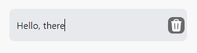
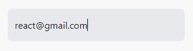
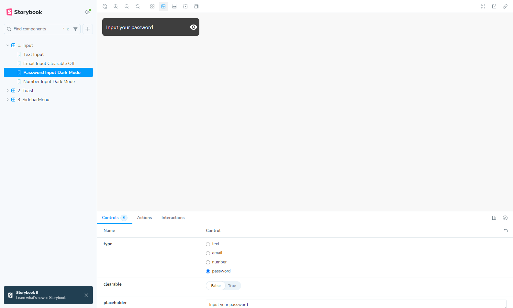
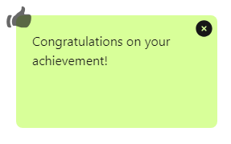
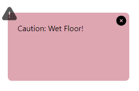
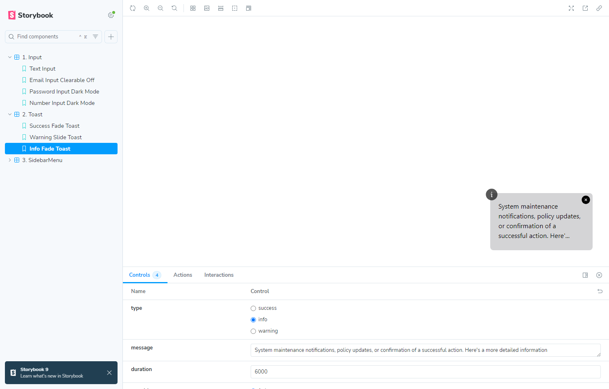
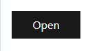
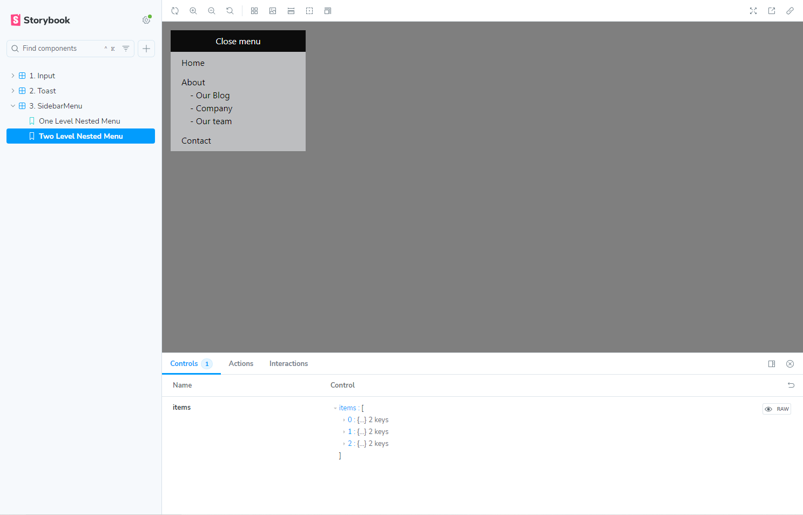

# 🎴 Storybook Task

This project was built to demonstrate Storybook UI components in React, NextJS with Typescript. It includes three type of components: Input, Toast and Sidebar Menu, each organized in relevant sections with different scanarios cases.

---

### 🔍 Input

The Input component supports multiple types, like text and password, with a clear button and password toggle.


Text input with ``` clearable=true ```

Email input with ``` clearable=false ```

Password input with dark theme

---

### 📌 Toast

The Toast component shows notifications with animations and different styles.



Success toast with fade animation



Warning toast with slide animation



Info toast with large message

---

### 📸 Sidebar Menu

The SidebarMenu has nested items with a sliding animation.



Default state of Sidemenu bar.


Sidebar menu with one level nest.



Sidebar menu with two level nest.

---

### 🚀 Getting Started

- **1. Clone the repository**

```bash
git clone https://github.com/whitepink1/develops.today-task.git
cd storybook-task
```

- **2. Install dependencies**

```bash
npm install
# or
yarn install
```

- **3. Start the storybook server**

```bash
npm run storybook
```

### 📌 Notes 

- Developed by Kyrylo Prokopenko for [Develops.today](https://develops.today/) intern assessment.